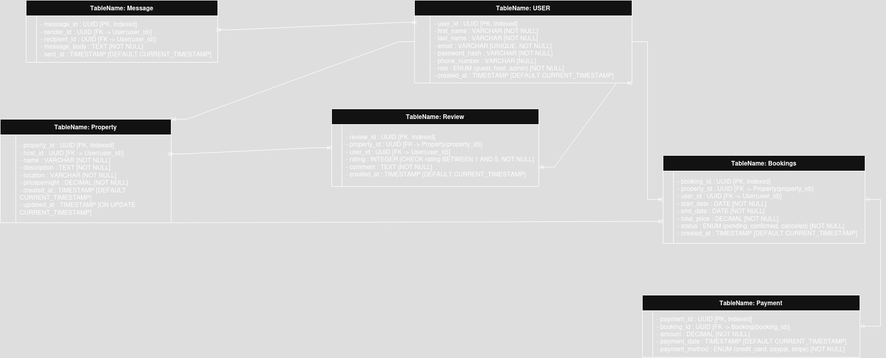

# Entity-Relationship Diagram Requirements

## Objective

Design an Entity-Relationship (ER) diagram for the `alx-airbnb-database` project to visually represent the structure of the database, its entities, and their relationships.

---

## ER Diagram

### 🖼️ ER Diagram Image

### 🔗 View/Edit Online
You can also view or edit the ER diagram directly on Draw.io using the link below:

[Open ER Diagram on Draw.io](https://viewer.diagrams.net/?tags=%7B%7D&lightbox=1&highlight=0000ff&edit=_blank&layers=1&nav=1&dark=auto#LUntitled%20Diagram.drawio)

---

## Entities and Attributes

### **User**
- `user_id`: UUID, Primary Key, Indexed
- `first_name`: VARCHAR, NOT NULL
- `last_name`: VARCHAR, NOT NULL
- `email`: VARCHAR, UNIQUE, NOT NULL
- `password_hash`: VARCHAR, NOT NULL
- `phone_number`: VARCHAR, NULL
- `role`: ENUM (`guest`, `host`, `admin`), NOT NULL
- `created_at`: TIMESTAMP, DEFAULT CURRENT_TIMESTAMP

### **Property**
- `property_id`: UUID, Primary Key, Indexed
- `host_id`: UUID, Foreign Key → User(`user_id`)
- `name`: VARCHAR, NOT NULL
- `description`: TEXT, NOT NULL
- `location`: VARCHAR, NOT NULL
- `pricepernight`: DECIMAL, NOT NULL
- `created_at`: TIMESTAMP, DEFAULT CURRENT_TIMESTAMP
- `updated_at`: TIMESTAMP, ON UPDATE CURRENT_TIMESTAMP

### **Booking**
- `booking_id`: UUID, Primary Key, Indexed
- `property_id`: UUID, Foreign Key → Property(`property_id`)
- `user_id`: UUID, Foreign Key → User(`user_id`)
- `start_date`: DATE, NOT NULL
- `end_date`: DATE, NOT NULL
- `total_price`: DECIMAL, NOT NULL
- `status`: ENUM (`pending`, `confirmed`, `canceled`), NOT NULL
- `created_at`: TIMESTAMP, DEFAULT CURRENT_TIMESTAMP

### **Payment**
- `payment_id`: UUID, Primary Key, Indexed
- `booking_id`: UUID, Foreign Key → Booking(`booking_id`)
- `amount`: DECIMAL, NOT NULL
- `payment_date`: TIMESTAMP, DEFAULT CURRENT_TIMESTAMP
- `payment_method`: ENUM (`credit_card`, `paypal`, `stripe`), NOT NULL

### **Review**
- `review_id`: UUID, Primary Key, Indexed
- `property_id`: UUID, Foreign Key → Property(`property_id`)
- `user_id`: UUID, Foreign Key → User(`user_id`)
- `rating`: INTEGER, CHECK (rating ≥ 1 AND rating ≤ 5), NOT NULL
- `comment`: TEXT, NOT NULL
- `created_at`: TIMESTAMP, DEFAULT CURRENT_TIMESTAMP

### **Message**
- `message_id`: UUID, Primary Key, Indexed
- `sender_id`: UUID, Foreign Key → User(`user_id`)
- `recipient_id`: UUID, Foreign Key → User(`user_id`)
- `message_body`: TEXT, NOT NULL
- `sent_at`: TIMESTAMP, DEFAULT CURRENT_TIMESTAMP

---

## Relationships

- **User ↔ Property**: One-to-Many (A host can list multiple properties)
- **User ↔ Booking**: One-to-Many (A user can make multiple bookings)
- **Property ↔ Booking**: One-to-Many (A property can be booked multiple times)
- **Booking ↔ Payment**: One-to-One (Each booking has one payment)
- **Property ↔ Review**: One-to-Many (A property can have many reviews)
- **User ↔ Review**: One-to-Many (A user can leave many reviews)
- **User ↔ Message**: One-to-Many for both sender and recipient (Users can send and receive messages)

---

## Constraints

### User
- Unique constraint on `email`
- Non-null constraints on required fields

### Property
- Foreign key constraint on `host_id`
- Non-null constraints on key attributes

### Booking
- Foreign key constraints on `property_id`, `user_id`
- Status limited to: `pending`, `confirmed`, `canceled`

### Payment
- Foreign key constraint on `booking_id`

### Review
- Foreign key constraints on `user_id`, `property_id`
- Rating must be between 1 and 5

### Message
- Foreign key constraints on `sender_id`, `recipient_id`

---

## Indexing

- All primary keys are indexed by default
- Additional indexes:
  - `email` in the User table
  - `property_id` in Property and Booking tables
  - `booking_id` in Booking and Payment tables

---
